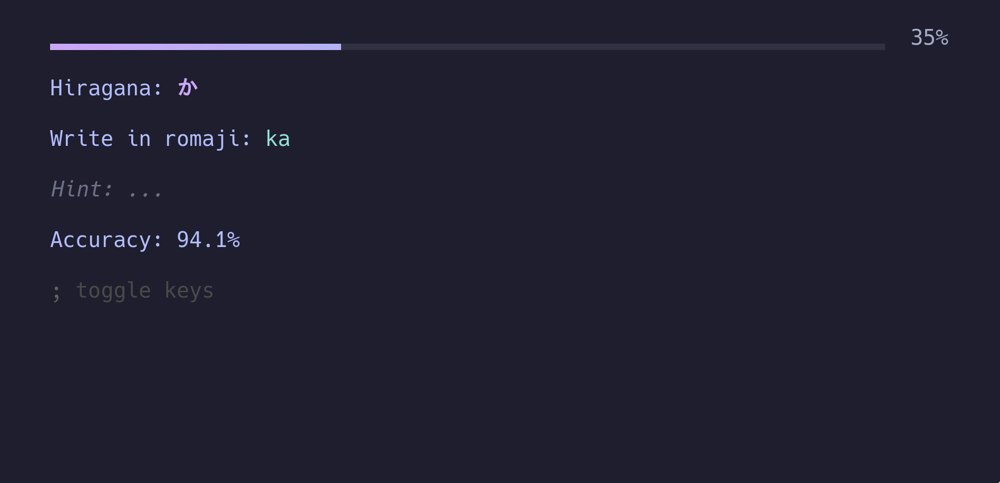

# Kana-CLI


## Welcome to Kana-CLI!

This project aims to be a helpful tool for learners of the Japanese language. It's still in a very 
early stage but you can use it to practise Hiragana and Katakana already.



## How To

Install it:

```sh
go install github.com/mec-nyan/kana-cli/cmd/kli@latest
```

Run it:

```sh
kli
```

Have fun!

### Without installing

```sh
# Clone the repository:
git clone https://github.com/mec-nyan/kana-cli.git

# Change directory:
cd kana-cli

# Run:
go run cmd/kli/main.go

# Have fun!
```


## Wishlist:

- [ ] Flashcards
- [x] Hiragana
- [x] Katakana
- [ ] Kanji
- [ ] Sound
- [ ] Numbers
- [ ] Words
- [ ] Grammar
- [ ] Everyday phrases
- [ ] A lot more, lol

## Thanks to:

- [Catppuccin](https://catppuccin.com/) for their awesome theme/palettes.
- [Vim](https://www.vim.org/) and [Neovim](https://neovim.io/) for an amazing editor.
